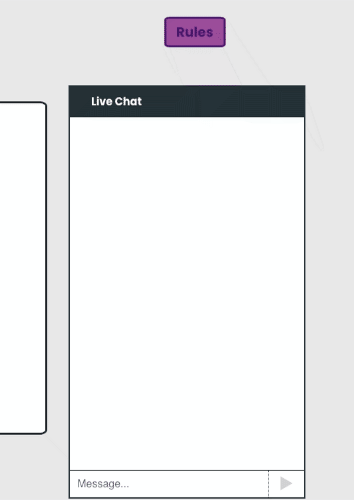

# Project #Chique! - Questions & Answers
by Wisdom Ibole  

The chat client feature allows for quasi-live communication/chatting between game players.  This component makes use of asynchronous functions, Axios, CSS, Express, React (hooks & classes), and Socket.io, among other things.

### How Does It Work?
- Individual socket connections allow for the identification of different players
- Messages from players within a room are broadcast only to members associated with that room
- React state allows for the display of all messages; new spectators are thus able to see all the previous messages